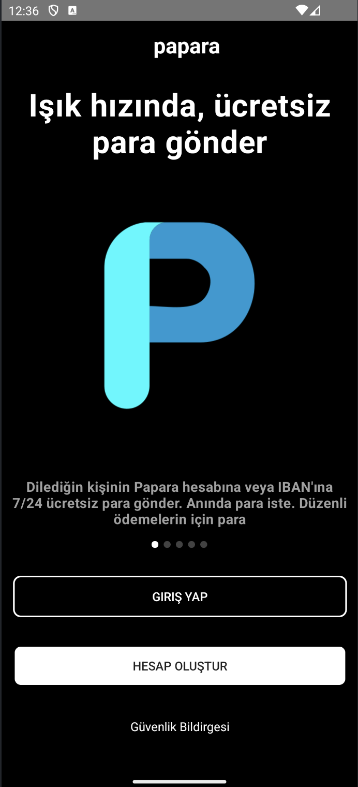

# Papara Onboarding Sample

This project is a sample implementation of the onboarding flow inspired by the Papara app. It demonstrates how to create a multi-step onboarding process in a Kotlin-based Android application using fragments and ViewPager2.

## Features
- **Multi-Step Onboarding:** A 5-step onboarding flow that guides users through the app's key features.
- **Fragment Navigation:** Uses the Navigation Component for smooth transitions between steps.
- **ViewPager2 Integration:** Seamless swiping experience between onboarding steps using ViewPager2.
- **Modern UI:** Follows Material Design guidelines for a clean and intuitive user interface.

## Technologies Used
- **Kotlin**
- **Android Navigation Component**
- **ViewPager2**
- **View Binding**
- **Material Design Components**

## Screenshots

### Onboarding 1

### Onboarding 2

### Onboarding 3

### Onboarding 4

### Onboarding 5

